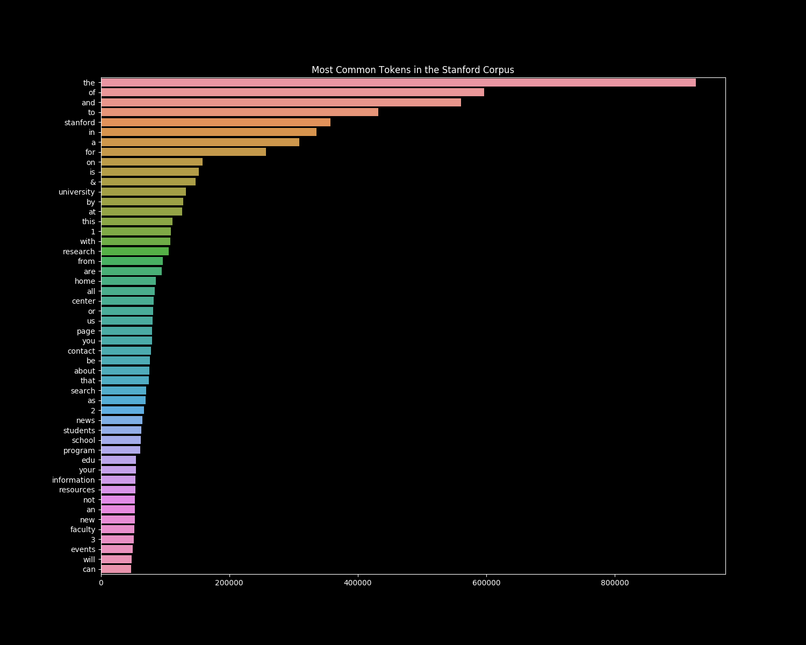

# Projet de Systeme de Recherche d'Information [Cours FRIWEB]

## Getting Started

### Prerequisites

Please specify the path of the data corpus (line 20 in main.py)

### Use the Search Engine

To launch the main program, run:  python3 main.py model [query]

Model should be chosen in ['boolean', 'vectorial']

If query is not specified, the engine will run the given queries, i.e:

queries = ["we are",
        "stanford class",
        "stanford students",
        "very cool",
        "the",
        "a",
        "the the",
        "stanford computer science",
        "we are stanford class stanford students very cool the a the the stanford computer science"
]

The first time, the indexes will be dumped on disk in the 'saved_models_and_indexes' directory.
If the program finds this directory, it will load indexes from it instead of rebuilding them.

Outputs of the search engine are dumped in the 'outputs' folder

### Analysis

Once the models and indexes have been built, you can run tools/analysis.py to get more info about the corpus and visualize the histogram of the 50 most frequent words.

A text file 'corpus_analysis.txt' summarizes the info.

 

 
